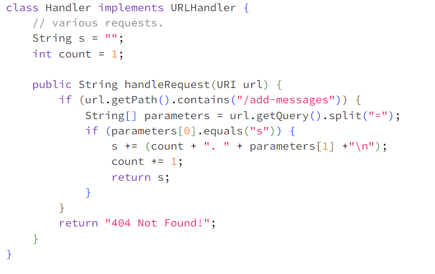
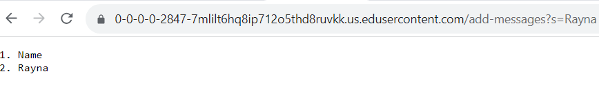
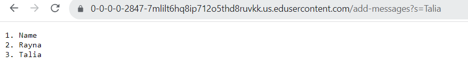
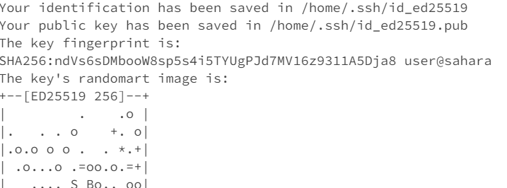
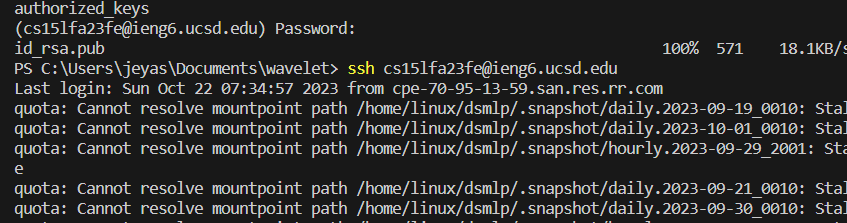

  **Part 1** 
 
Screenshot 1: 
Which methods in your code are called? 
The handleRequest method is called. 

What are the relevant arguments to those methods, and the values of any relevant fields of the class? 
the relevant arguments include the url which is parsed to extract the value of s given. The value of relevant fields include count and s. The value of count is currently 2. The value of s is given by the output. 

How do the values of any relevant fields of the class change from this specific request? If no values got changed, explain why. 
The count was initially 1 and it was incremented to 2. The new string (Rayna) was also added to the s string. 
  
Screenshot 2: 
Which methods in your code are called? 
The handleRequest method is called  

What are the relevant arguments to those methods, and the values of any relevant fields of the class? 
The relevant arguments include the url which is parsed to extract the value of s given. The values of relevant fields include count and s. The value of count is currently 3. The value of s is given by the output. 

How do the values of any relevant fields of the class change from this specific request? If no values got changed, explain why. 
The count was initially 2 and it was incremented to 3. The new string (Talia) was added to the s string. 
  
 **Part 2** 
 Path to the private key 
 The private key is given by the first line (the one without _pub added at the end) 
  
 Path to the public key  
 ls - the files within wavelet..  
  
 Interaction where I didn't have to include my password to sign into the course-specific account. 
 ls- also within the wavelet directory 
  
 
 **Part 3**  
 Before this class I didn't know anything about the command line or GitHub, I had just very minimally heard about it. These past weeks I learned how to change directories using the terminal, how to create a server and how to add files into a GitHub repository. Surely these skills will be very useful in the future to both showcase and enhance my coding skills. 
 
